# Optare Architecture Documentation

This document provides a comprehensive technical overview of **Optare**, a minimalist content discovery platform that aggregates feeds from multiple platforms (Hacker News, Dev.to, YouTube, RSS feeds) into a single personalized reader.

---

## 1. High-Level Architecture Diagram

The system follows a classic decoupled client-server architecture with an asynchronous background ingestion engine and a PostgreSQL relational database.

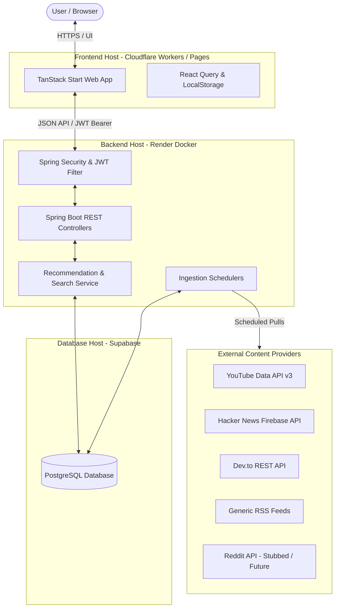

---

## 2. Detailed Architecture Diagram

A more detailed view showing the actual core classes, client modules, and data repositories.

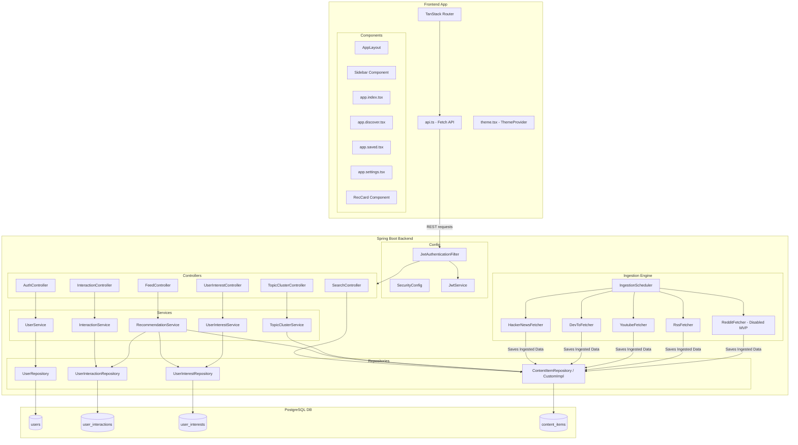

---

## 3. Deployment Architecture

The deployment architecture is optimized for performance, scalability, and minimal server load.

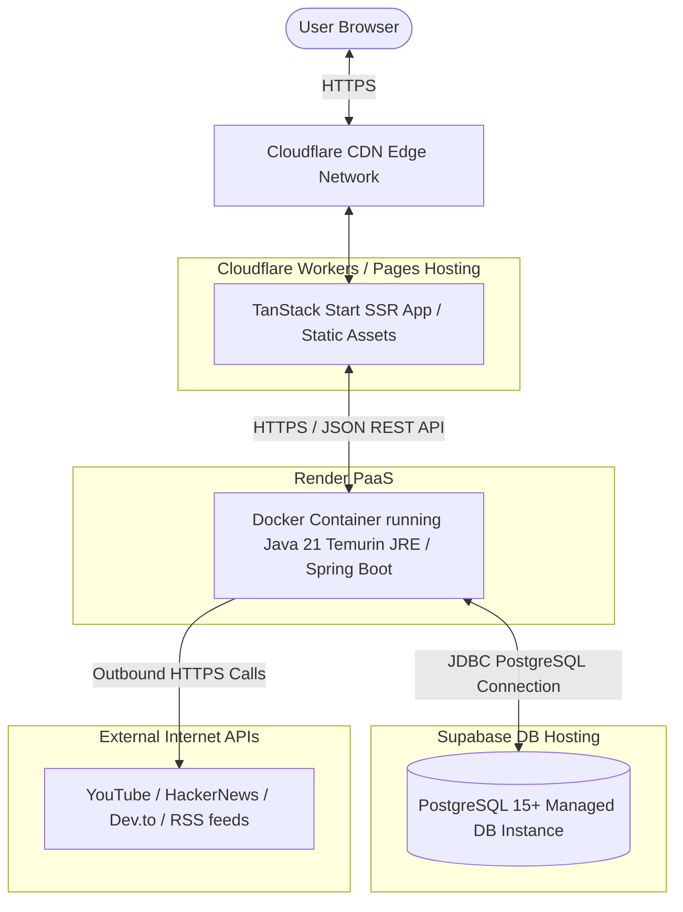

---

## 4. Data Flow Diagram

Shows how content flows from external providers into the system, gets processed, and is served back to the user.

```mermaid
graph LR
    Ext[External APIs] -->|Scheduled Pull - 45 mins| Fetchers[Fetcher Engines]
    Fetchers -->|Unique Check via Source & ExternalId| Save[saveOrUpdateItems]
    Save -->|INSERT/UPDATE| DB[(PostgreSQL content_items)]
    
    DB -->|Fetch Candidates| Rec[Recommendation Service]
    UserProfile[User Profile & Interactions] -->|Exclusions & Category Weights| Rec
    
    Rec -->|1. Filter out DISMISS/VIEW| Filter[Filtering Layer]
    Filter -->|2. Compute Score: Interest + Freshness + Engagement + Similarity + Diversity| Rank[Ranking Layer]
    Rank -->|Sort DESC| Controller[Feed Controller]
    Controller -->|PageImpl JSON| Client[Vite Frontend Client]
    Client -->|Render HTML| User([End User])
```

---

## 5. Authentication Flow Diagram

Supports both JWT Authenticated Users and an Unauthenticated Guest Mode.

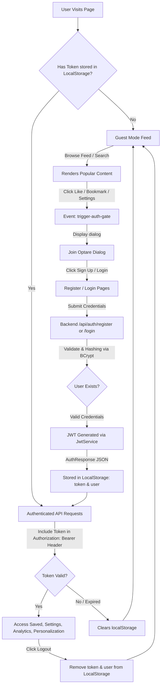

---

## 6. Recommendation Flow Diagram

The backend scores and ranks feed elements on-the-fly when a request is received.

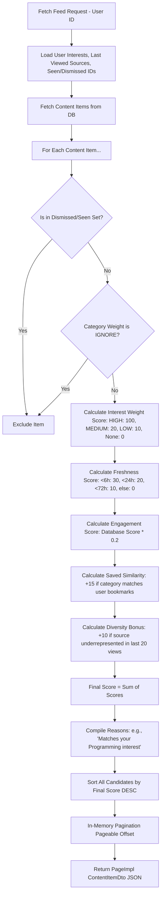

---

## 7. Search Flow Diagram

Search relies on PostgreSQL database indexing and native text search components.

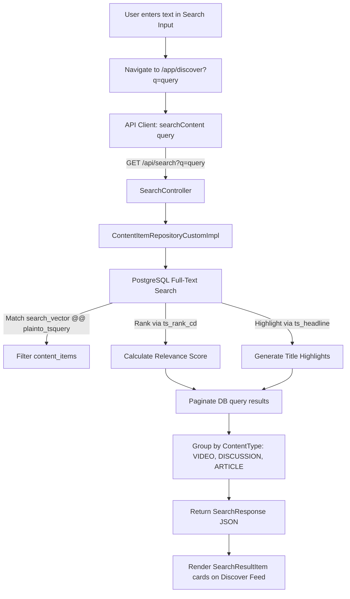

---

## 8. Backend Layer Diagram

Optare follows a standard layered architecture. The key files in each layer are documented below.

```
┌────────────────────────────────────────────────────────────────────────┐
│                          Controller Layer                              │
│                                                                        │
│ - AuthController.java             - FeedController.java                │
│ - InteractionController.java      - SearchController.java              │
│ - UserInterestController.java     - TopicClusterController.java        │
│ - AnalyticsController.java                                             │
└───────────────────────────────────┬────────────────────────────────────┘
                                    │ (Drives REST APIs)
                                    ▼
┌────────────────────────────────────────────────────────────────────────┐
│                            Service Layer                               │
│                                                                        │
│ - UserService.java                - InteractionService.java            │
│ - TopicClusterService.java        - UserInterestService.java           │
│ - AnalyticsService.java                                                │
│ - IngestionScheduler.java         - ContentFetcher (Interface)         │
│ - HackerNewsFetcher.java          - DevToFetcher.java                  │
│ - YoutubeFetcher.java             - RssFetcher.java                    │
│ - RedditFetcher.java (MVP Stub)                                        │
└───────────────────────────────────┬────────────────────────────────────┘
                                    │ (Business Logic & Scheduling)
                                    ▼
┌────────────────────────────────────────────────────────────────────────┐
│                        Recommendation Layer                            │
│                                                                        │
│ - RecommendationService.java (Core logic & mathematical scoring)       │
└───────────────────────────────────┬────────────────────────────────────┘
                                    │ (Uses JPA Entities)
                                    ▼
┌────────────────────────────────────────────────────────────────────────┐
│                         Repository Layer                               │
│                                                                        │
│ - UserRepository.java             - UserInteractionRepository.java     │
│ - UserInterestRepository.java     - ContentItemRepository.java         │
│ - ContentItemRepositoryCustom.java- ContentItemRepositoryCustomImpl.java│
└───────────────────────────────────┬────────────────────────────────────┘
                                    │ (JDBC / Hibernate Queries)
                                    ▼
┌────────────────────────────────────────────────────────────────────────┐
│                         PostgreSQL Database                            │
│                                                                        │
│ - users                           - user_interests                     │
│ - content_items                   - user_interactions                  │
└────────────────────────────────────────────────────────────────────────┘
```

---

## 9. Frontend Component Hierarchy

The frontend is structured with file-based routing and a shared application layout shell containing a collapsible sidebar and dynamic search header.

```
Landing (index.tsx)
  └── Signup Page (signup.tsx)
  └── Login Page (login.tsx)
  └── App Shell Route (/app) (app.tsx)
        └── AppLayout (app-layout.tsx)
              ├── Sidebar Navigation
              │     ├── Brand Logo (logo.tsx)
              │     ├── Navigation Links (Home, Discover, Saved, Settings)
              │     └── Account Dropdown (User Profile / Guest Mode)
              ├── Header
              │     ├── Search Input Form (Triggers Discover Search)
              │     └── Auth Actions (Log In/Sign Up buttons if guest)
              ├── Pages (Dynamic Router Outlets)
              │     ├── Feed / Home Route (app.index.tsx)
              │     │     ├── Interest Tags Carousel
              │     │     └── Recommendation Feed Grid
              │     │           └── RecCard / RecCardSkeleton (rec-card.tsx)
              │     ├── Discover / Search Route (app.discover.tsx)
              │     │     ├── Search Results Grouping (Video, Discussion, Article)
              │     │     └── RecCard Grids
              │     ├── Saved Collections Route (app.saved.tsx)
              │     │     ├── Saved / Bookmark Folders List
              │     │     └── RecCard Grids
              │     ├── Collections Route (app.collections.tsx)
              │     │     └── Collection Feeds
              │     ├── Trending Topics Route (app.trending.tsx)
              │     │     └── Topic Clusters
              │     ├── Analytics Dashboard Route (app.analytics.tsx)
              │     │     ├── Activity Heatmap Chart (Recharts)
              │     │     └── Feed Diversity Breakdown Radar/Pie charts
              │     └── Settings Route (app.settings.tsx)
              │           ├── Platform Connections Card (localStorage state)
              │           ├── Interest Categories Weight Card
              │           └── Profile details card
              └── Shared Dialogs
                    └── Auth Gate Modal (Dialog, DialogContent, DialogHeader)
```

---

## 10. Database Relationship Overview

The database is built on PostgreSQL with Flyway migration management (`V1__init.sql` and `V2__improve_search_ranking.sql`).

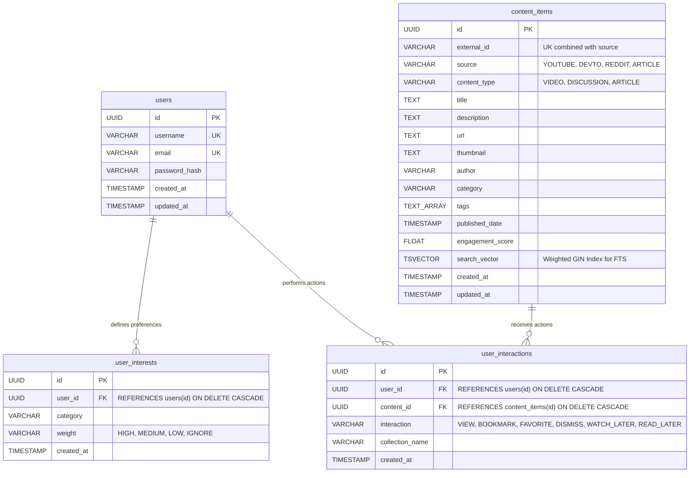

---

## 11. Sequence Diagrams

### 11.1 User Login Flow
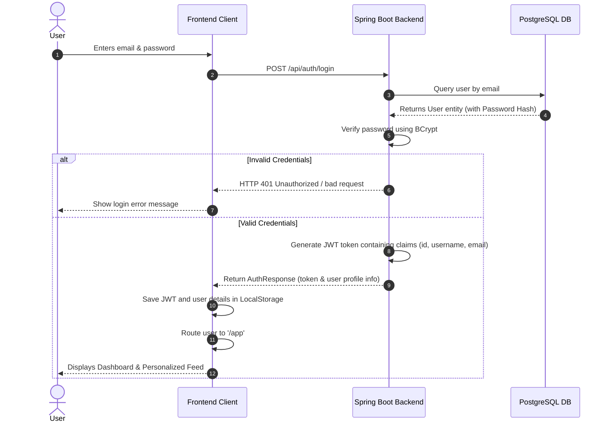

### 11.2 User Registration Flow
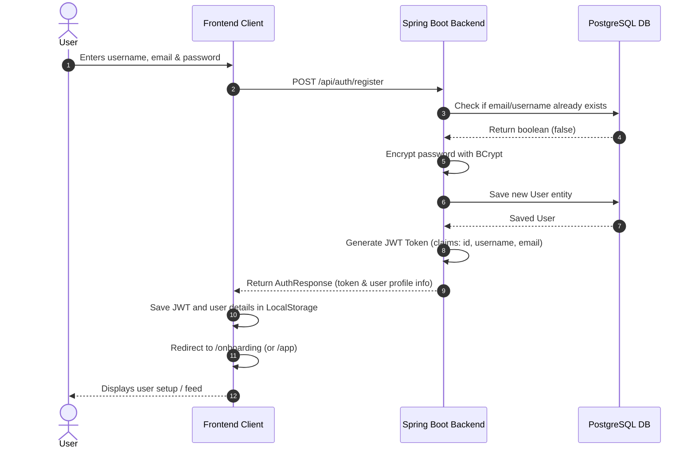

### 11.3 Load Recommendations Flow
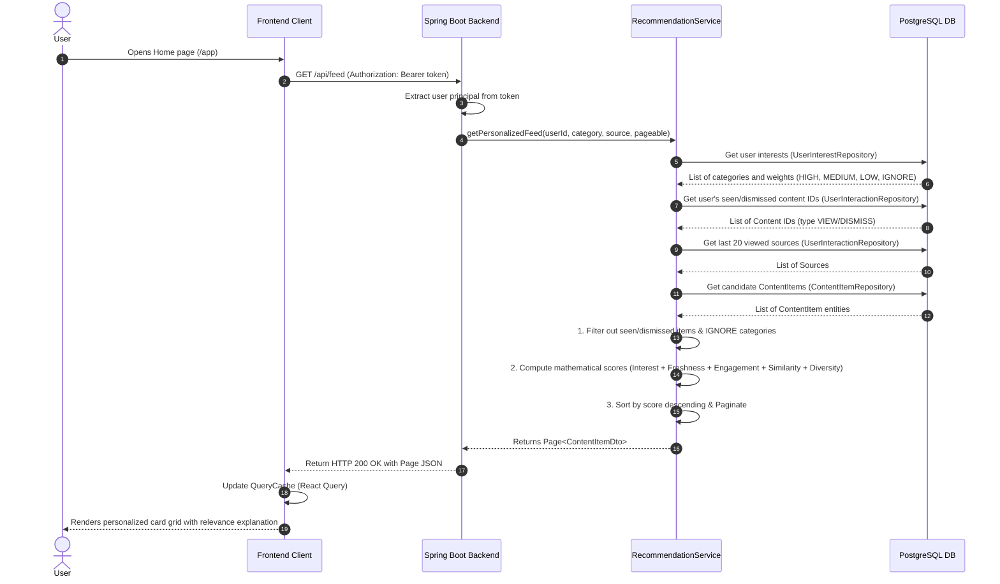

### 11.4 Search Content Flow
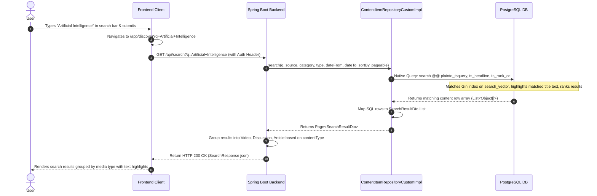

### 11.5 Bookmark Content Flow
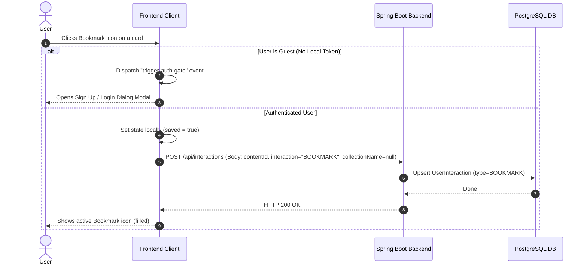

### 11.6 Guest Browsing Flow
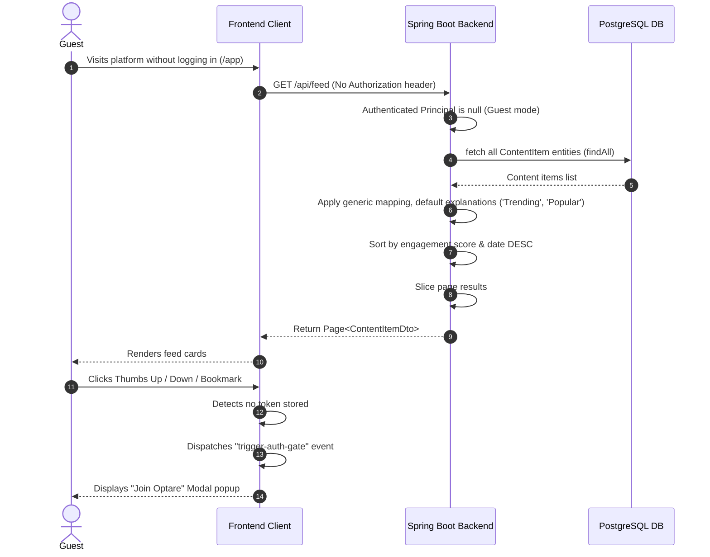

---

## 12. Technology Stack

| Category | Component / Technology | Purpose |
|---|---|---|
| **Frontend Framework** | React 19 / TanStack Start | Core UI framework & server-side rendering support |
| **Routing** | TanStack Router | File-based client-side routing & search parameter validation |
| **State Management** | TanStack React Query (v5) | Server state management, cache management, & background updates |
| **Theme & UI Elements**| Radix UI primitives & Lucide Icons | Accessible interface controls, icons, & dashboard layouts |
| **Styling** | Tailwind CSS v4 & Custom CSS | Responsive layouts, custom fonts, dark/light modes, & animations |
| **Language** | TypeScript (Frontend) & Java 21 (Backend)| Safe type interfaces & modern backend syntax |
| **Backend Core** | Spring Boot 3.x (with Web, JPA, Security, Actuator)| REST controller mapping, dependencies, scheduler, & system APIs |
| **Security** | Spring Security & JWT Token Auth | Stateless API endpoint protection, password salting |
| **Database** | PostgreSQL (v15+) | Data persistence, full-text indexing, & ranking triggers |
| **Flyway** | flyway-core | Direct database schema migration version tracking |
| **Build Tools** | Vite 7 & Maven | Compilation, server bundling, & backend package management |
| **Hosting** | Cloudflare Workers & Render Docker | Frontend serverless edge hosting & backend container web service |

---

## 13. Draw.io Integration and Export Guide

Mermaid is natively supported inside Draw.io. You can import any of the diagrams above directly using the following steps:

1. Open a new or existing diagram in **draw.io** (or app.diagrams.net).
2. Click the **`+` (Insert)** button on the top toolbar or select `Arrange` > `Insert`.
3. Select **Advanced** > **Mermaid**.
4. Copy and paste the Mermaid code block of any diagram from this document into the text area.
5. Click **Insert** to render the vector diagram directly onto your canvas.
