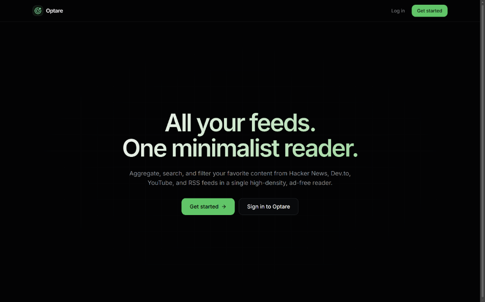
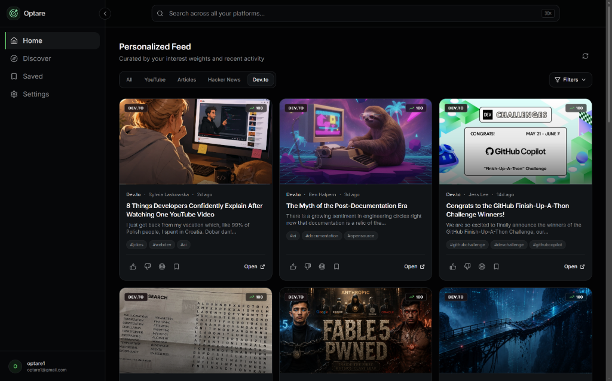
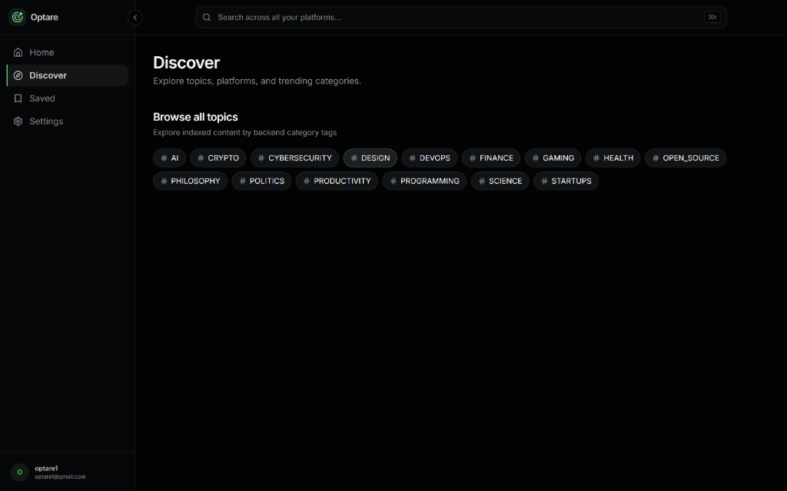
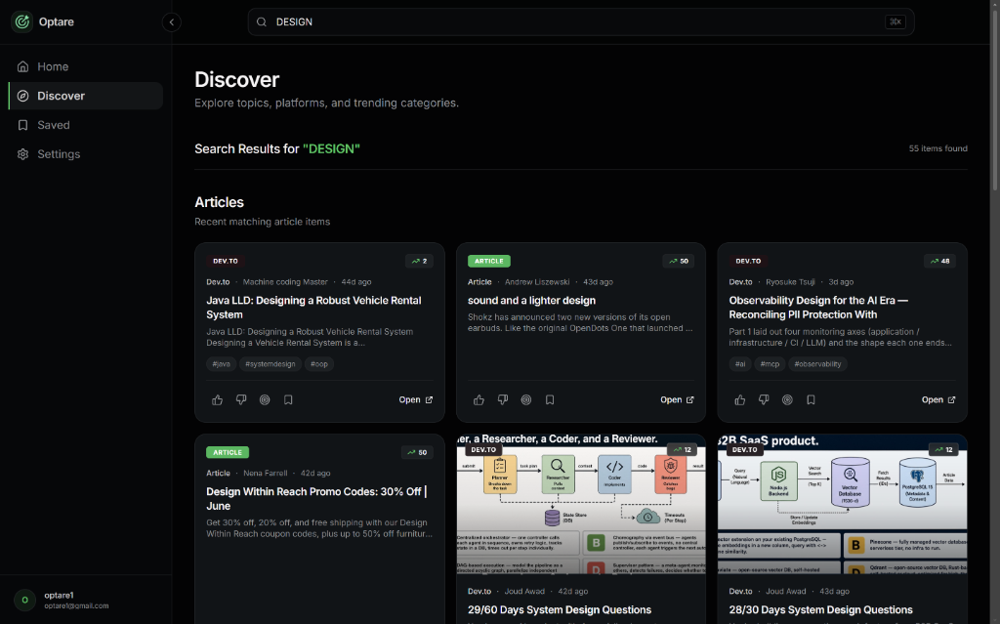
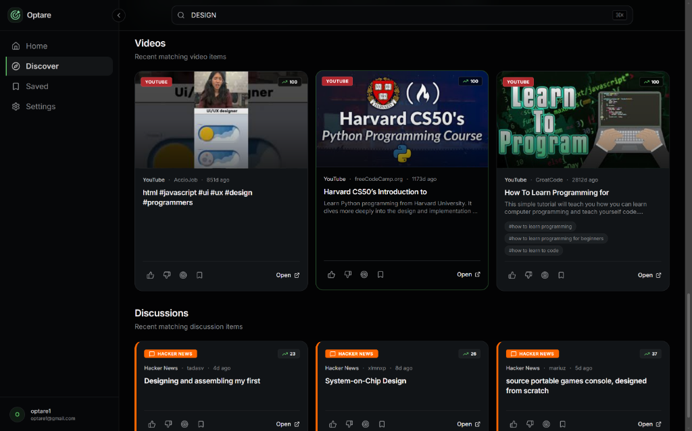

# Optare Architecture

Optare follows a modern three-tier architecture consisting of a React-based frontend, a Spring Boot backend, and a PostgreSQL database.

---

## Interface Preview

### Landing Page

---

### Personalized Feed

---

### Discover Topics

---

### Search & Articles

---

### Videos & Discussions Search

---

## Frontend Layer

* React + TanStack Start
* TypeScript
* Tailwind CSS
* Cloudflare Workers deployment
* Responsive user interface
* JWT-based authentication handling

## Backend Layer

* Spring Boot REST API
* JWT Authentication & Authorization
* Recommendation Engine
* Search Service
* User Interaction Tracking
* Content Aggregation Logic

## Data Layer

* PostgreSQL (Supabase)
* User Profiles
* Interests
* Content Metadata
* Bookmarks
* Interaction History

## External Integrations

* YouTube Data API
* Hacker News
* Dev.to
* Web Articles / RSS Sources

## Recommendation Flow

User Activity
→ Interest Profile
→ Recommendation Engine
→ Ranking & Filtering
→ Personalized Feed

## Deployment

Frontend:
Cloudflare Workers

Backend:
Render

Database:
Supabase PostgreSQL

Authentication:
JWT Tokens
